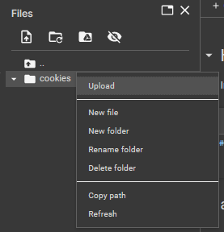

# Netflix Cookie Checker - Colab Version

**Checks Cookies for validity.**

# Usage

1. Open the [Colab Notebook](https://colab.research.google.com/drive/1DP-77oUKjB4ERMaWvpWyffyRtiqFj-Ae?usp=sharing).
2. Upload cookies to 'cookies' folder.

   
3. Run Install requirements cell.
4. Run cookies converter cell.
5. Run start cookie checker cell.

# For any issues

# You can help me by Donating
  
