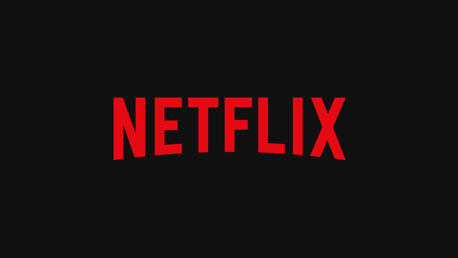

# Netflix Cookie Checker — GUI Edition

A modern, fast, and dark-themed graphical interface for checking Netflix cookies and converting Netscape format cookies to JSON.



## ✨ Features
- **Modern Dark UI** built with Tkinter & `sv_ttk`
- **Checker Tab**: Multi-threaded cookie verification with live status, statistics, and detailed logging
- **Converter Tab**: Drag-and-drop / browse Netscape cookies to JSON conversion
- **Duplicate Detection**: Cookie fingerprinting prevents saving duplicate working sessions
- **Proxy Support**: Optional HTTP / HTTPS / SOCKS proxies with automated testing

## 🚀 Installation & Usage

1. Clone and switch to the GUI branch:
```bash
git clone -b GUI https://github.com/matheeshapathirana/Netflix-cookie-checker.git
cd Netflix-cookie-checker
```

2. Install dependencies:
```bash
pip install -r requirements.txt
```

3. Launch the application:
```bash
python main.py
# or
python gui.py
```